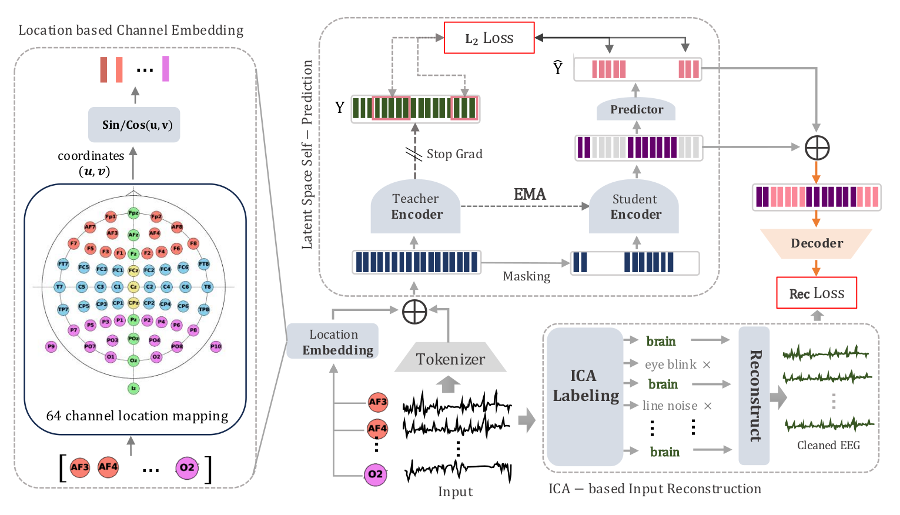

## EEG-X: A Universal Framework for Robust EEG Representation Learning

#### Authors: [Navid Mohammadi Foumani](https://scholar.google.com.au/citations?user=Ax62P1MAAAAJ&hl=en), 
[**Mahsa Salehi**](https://research.monash.edu/en/persons/mahsa-salehi),
[Soheila Ghane](https://www.linkedin.com/in/soheila-ghane/?originalSubdomain=au), 
[Nam Nguyen](),
[Geoffrey I. Webb](https://scholar.google.com.au/citations?user=_1tpf8AAAAAJ&hl=en),
[**Geoffrey Mackellar**](https://www.linkedin.com/in/geoffmackellar/?originalSubdomain=au), 

This work follows from the project with [**Emotiv Research**](https://www.emotiv.com/neuroscience-research-education-solutions/), a bioinformatics research company based in Australia, and [**Emotiv**](https://www.emotiv.com/), 
a global technology company specializing in the development and manufacturing of wearable EEG products.

#### EEG-X Paper: [comming soon](https:)

This is a PyTorch implementation of **EEG-X: A Universal Framework for Robust EEG Representation Learning**

    

 

## Datasets 

1. **Emotiv:**
   To download the Emotiv public datasets, please follow the link below to access the preprocessed datasets, which are split subject-wise into train and test sets. After downloading, copy the datasets to your Dataset directory.

   [Download Emotiv Public Datasets](https://drive.google.com/drive/folders/1KQyST6VJffWWD8r60AjscBy6MHLnT184?usp=sharing)

2. **Temple University Datasets:**
   Please use the following link to download and preprocess the TUEV and TUAB datasets.

   [Download Temple University Datasets](https://github.com/ycq091044/BIOT/tree/main/datasets)

3. **BCICIV_2A**

## Setup

_Instructions refer to Unix-based systems (e.g. Linux, MacOS)._

This code has been tested with `Python 3.9.12`.

`pip install -r requirements.txt`

## Run

To see all command options with explanations, run: `python main.py --help`
In `main.py` you can select the datasets and modify the model parameters.
For example:

`self.parser.add_argument('--epochs', type=int, default=100, help='Number of training epochs')`

or you can set the parameters:

`python main.py --epochs 100 --data_dir Dataset/Crowdsource`
